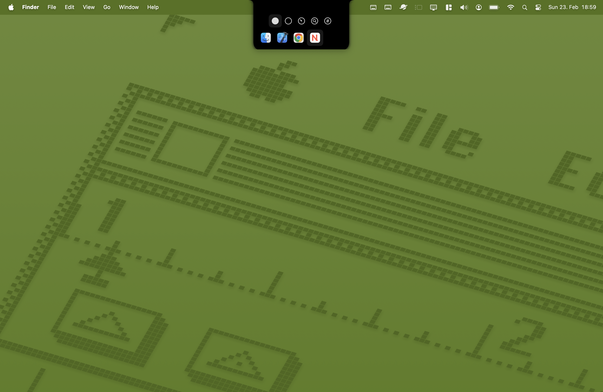
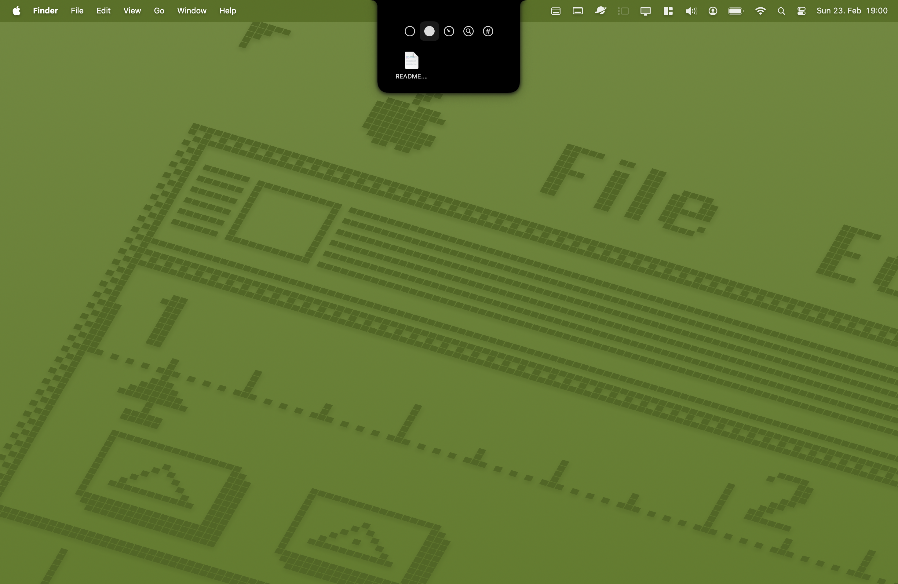
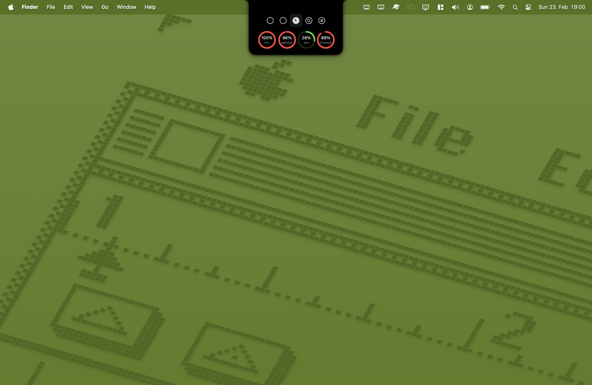
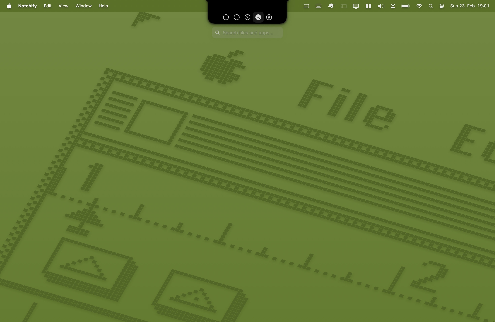

# Notchify

## Overview

Notchify is a macOS application that tries to convert the MacBook notch to a functional workspace element.

## Features

### Current Implementation

- **Quick App Launcher**: _[Coming Soon]_
- **File Storage**: Convenient file management right from the notch
- **Performance Monitor**: Real-time system statistics
- **Search Functionality**: _[Coming Soon]_

### Feature Screenshots

|        Quick App Access        |         File Storage Hub          |        Performance Monitor        |         Universal Search         |
| :----------------------------: | :-------------------------------: | :-------------------------------: | :------------------------------: |
|  |  |  |  |
|  Launch apps instantly (WIP)   |     Manage files efficiently      |       Track system metrics        |       Search feature (WIP)       |

## 🛠️ Installation

Get Notchify up and running in three simple steps:

1. Clone the repository:

   ```bash
   git clone https://github.com/jacob8444/Notchify.git
   ```

2. Open the project in Xcode

3. Build and run on your MacBook

## 🚧 Project Status

This is a work in progress and my first Swift project.
